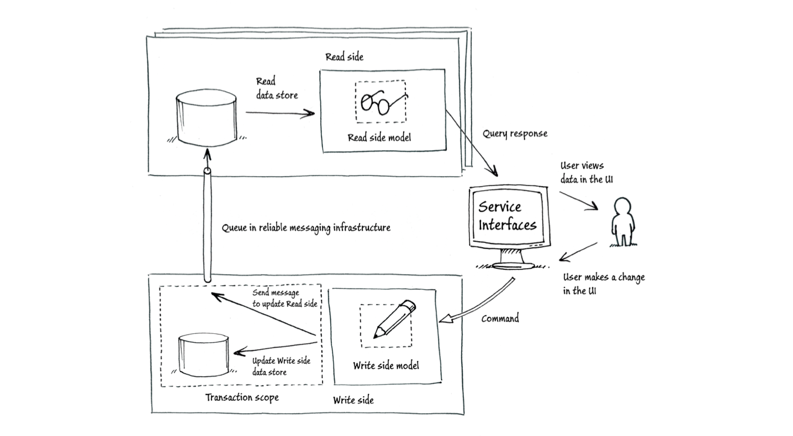

# Meetup Micro-services

The project explores micro-service oriented application design with use of CQRS principle:

It consists of two services:

- users-api - provides REST API to clients and implements the Query part of CQRS.
It uses Elasticsearch as projection repository updated by events generated by users-handler.
- users-handler - implements the Command part of CQRS and uses h2 database for persistence.

The services communicate via JMS bus provided by Apache ActiveMQ.

## Prerequisities

Install Docker Machine and Compose: http://docs.docker.com/machine/install-machine/

## Build and Run

> git clone https://github.com/benzohub/meetup.git

> cd meetup

> ./gradlew buildDocker

> ./runall

If everything went well, you should see a lot of log messages in the console without errors among them ;)

Visit the following urls:

`http://192.168.99.100:8080/users` - list of registered users

`http://192.168.99.100:8161/admin/queues.jsp` - ActiveMQ Admin page listing queues

`192.168.99.100` is the default IP of the docker VM. It can be retrieved by calling:

> docker-machine ip default

### Create new user

curl -XPOST 'http://192.168.99.100:8080/users' -H 'Content-Type: application/json' -d '{
    "userName" : "eupestov",
    "userFullName" : "Eugene Pestov"
}
'

curl -XPOST 'http://192.168.99.100:8080/users' -H 'Content-Type: application/json' -d '{
    "userName" : "bonny",
    "userFullName" : "Bonny Nord"
}
'

### Create new users connection

curl -XPOST 'http://192.168.99.100:8080/users/eupestov/connections' -H 'Content-Type: application/json' -d '{
    "userName" : "bonny"
}
'

The API Specification is available in docs/api in RAML format.

## UI

After the services started successfully you can run the simplistic UI as described in ui/README.md
