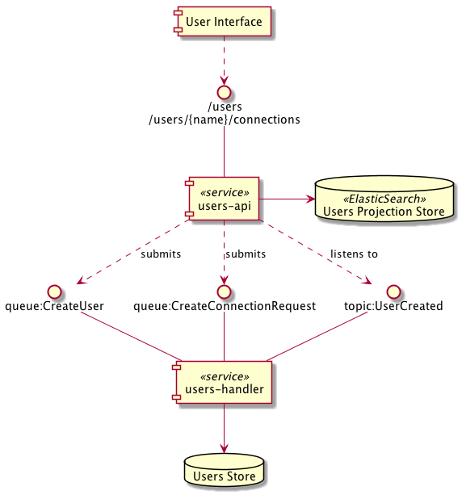
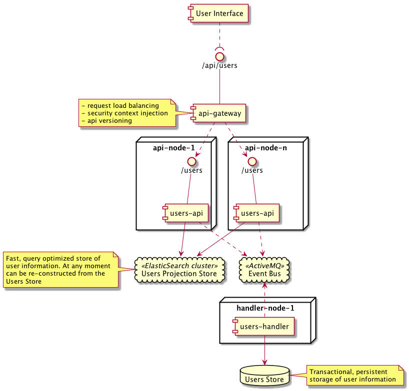

# Meetup Users Servce Capability Design
## Table of Contents
1. [Overall design](#overall-design)
2. [Component Diagram](#component-diagram)
3. [Deployment diagram](#deployment-diagram)
4. [Service interface](#service-interface)
5. [Frameworks and Technologies](#frameworks-technologies)
    - [Spring Boot](#spring-boot)
    - [Spring Data](#spring-data)
    - [Liquibase](#liquibase)

## Overall design<a name="overall-design"/>
The goal of this capability is to provide information of registered users and their connections.
The capability will provide an API for new user registration and connection requests and also a query
interface for users and their connections.

## Component Diagram<a name="component-diagram" />

The split into users-api and users-handler module allows to achieve the following goals:

- independent horizontal scalability of both parts as required by service load
- query optimized data model and storage for maximum performance
- segregation of query and command (change) concerns to simplify individual parts

## Deployment Diagram<a name="deployment-diagram" />
The diagram below shows a set up how the components are to be deployed in the production environment.

## Service interface<a name="service-interface" />
The RAML definition for the interface is [provided](api/meetup-users.raml). It must be used as a contract between
Front-End and Back-end developers. For AngularJS the JS service code can be generated directly from the specification.

## Frameworks and Technologies<a name="frameworks-technologies" />

### Spring Boot<a name="spring-boot" />
A framework for (micro-)service development providing the following capabilities out of the box:

- Create stand-alone Spring applications (easy to run in containers)
- Embed Tomcat, Jetty or Undertow directly (no need to deploy WAR files, but also a possibility)
- Provide opinionated 'starter' POMs to simplify your Maven/Gradle configuration
- Automatically configure Spring whenever possible
- Provide production-ready features such as metrics, health checks and externalized configuration
- Many other components/frameworks provide integrations with Spring

### Spring Data<a name="spring-data" />
A fast hence extendable way of defining object repositories. Includes built-in support for pagination and sorting.
It makes it easy to use data access technologies, relational and non-relational databases, map-reduce frameworks,
and cloud-based data services. Spring Data is an umbrella project with specific implementation for JPA, Elasticsearch,
Neo4J etc.

### Liquibase<a name="liquibase" />
Liquibase provides database schema definition independence of particular DB product and enables database schema
change control, which comes in handy in Continuous Delivery environment of many independent service components.
